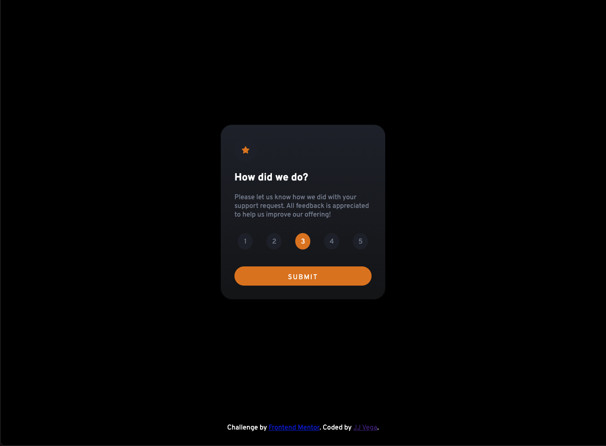
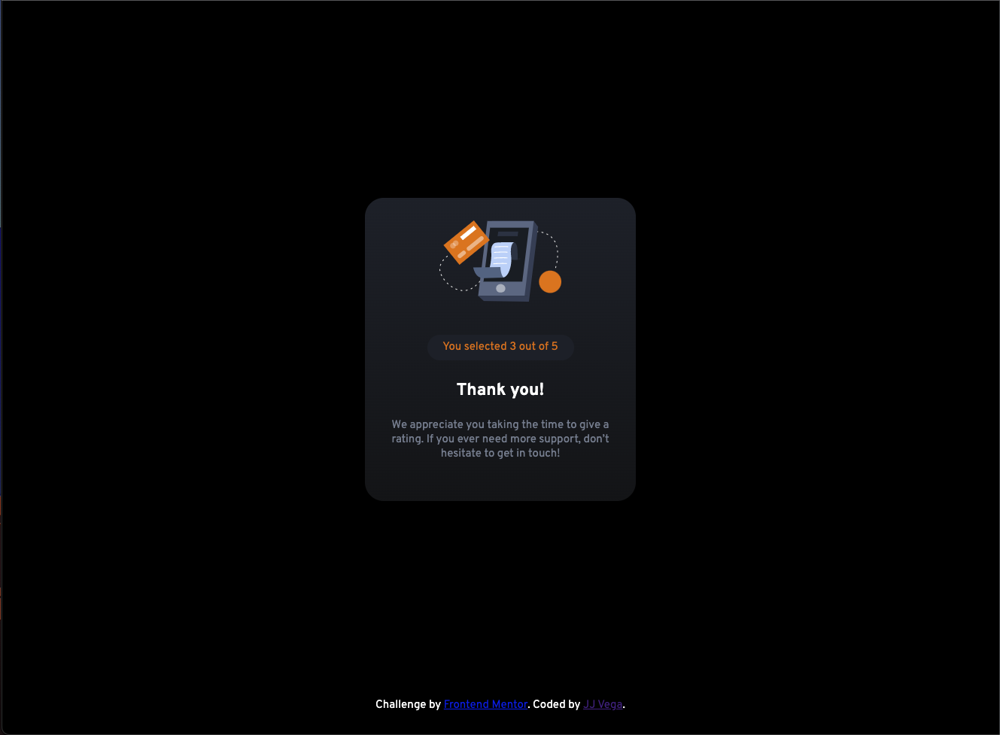

# Frontend Mentor - Interactive rating component solution

This is a solution to the [Interactive rating component challenge on Frontend Mentor](https://www.frontendmentor.io/challenges/interactive-rating-component-koxpeBUmI). Frontend Mentor challenges help you improve your coding skills by building realistic projects.

## Table of contents

- [Overview](#overview)
  - [The challenge](#the-challenge)
  - [Screenshot](#screenshot)
  - [Links](#links)
- [My process](#my-process)
  - [Built with](#built-with)
  - [What I learned](#what-i-learned)
  - [Continued development](#continued-development)
- [Author](#author)

## Overview

### The challenge

Users should be able to:

- View the optimal layout for the app depending on their device's screen size
- See hover states for all interactive elements on the page
- Select and submit a number rating
- See the "Thank you" card state after submitting a rating

### Screenshots

### Links

- Solution URL: [solution URL here](https://www.frontendmentor.io/solutions/interactive-rating-component-0blRqLd5Nn)
- Live Site URL: [live site URL here](https://interactive-rating-component-main-jade.vercel.app/)

## My process

I started with the markup and wrote out everything for both the rating state and thank you state components.

Then, I worked through the CSS, starting with global styles and working down through the components, starting with the rating component and moving into the thank you component.

After that, I wrote the JavaScript to track the active rating, handle submission of the rating, show the chosen rating in the thank you message, and swap between the two states.

For fun, I decided to add an animation to fade in the thank you component and also wrote the JavaScript to prevent submitting the rating without selecting an option.

### Built with

- Semantic HTML5 markup
- CSS custom properties
- Flexbox
- Mobile-first workflow

### What I learned

I have worked with React much more than vanilla JavaScript, so my main learnings were in the DOM/Event Listening category. Structuring the markup and identifiers was the key part to make transitions between states smooth and logical.

Keeping classes "single responsibility" was also a focus. I identified a handful of classes that basically did the same thing and consolidated for a more "utility" approach.

### Continued development

Manipulating shapes and working with colors are both growth areas for me. Logic is easy since I come from more of a backend background and have spent a fair amount of time working on DSA problems in JavaScript. Also, learning the ins and outs of how CSS works is a continued exploration - for example, learning that you can't run a transition on `display` property changes gave me a good perspective on animations and working with state toggling.

**Note: Delete this note and the content within this section and replace with your own plans for continued development.**

## Author

- Website - [JJ Vega](https://github.com/jjvega86)
- Frontend Mentor - [@jjvega86](https://www.frontendmentor.io/profile/jjvega86)
